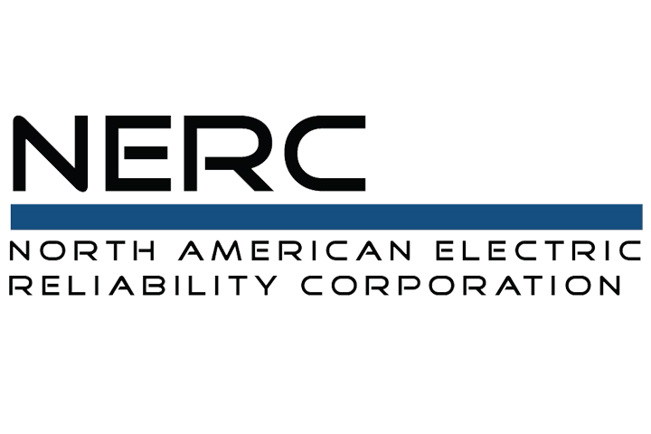


---

<!-- Dominion Energy -->

  

    

      <!-- Role -->
      <h3 style="margin: 0;">Graduate Intern, Electric Transmission Strategic Initiatives</h3>
      <!-- Company + Logo below Role -->
      

        
        <strong>Dominion Energy</strong>
      

    

    <!-- Location + Dates on the Right -->
    

      <strong>Richmond, VA</strong> 
     <strong>May 2024 – Aug. 2024</strong>
    

  

---

<!-- NERC -->

  

    

      <h3 style="margin: 0;">Graduate Intern, Advanced System Analytics &amp; Modeling</h3>
      

        
        <strong>North American Electric Reliability Corporation (NERC)</strong>
      

    

    

      <strong>Atlanta, GA</strong> 
      <strong>Jan. 2024 – May 2024</strong>
    

  

---

<!-- Dominion Energy (Planning – Modeling) -->

  

    

      <h3 style="margin: 0;">Graduate Intern, Electric Transmission Planning – Modeling</h3>
      

        
        <strong>Dominion Energy</strong>
      

    

    

      <strong>Richmond, VA</strong> 
      <strong>May 2023 – Aug. 2023</strong>
    

  

---

<!-- Georgia Tech -->

  

    

      <h3 style="margin: 0;">Graduate Research and Teaching Assistant</h3>
      

        
        <strong>Georgia Institute of Technology</strong>
      

    

    

      <strong>Atlanta, GA</strong> 
      <strong>Aug. 2021 – Dec. 2024</strong>
    

  

---

<!-- Sharif University of Technology -->

  

    

      <h3 style="margin: 0;">Graduate Research and Teaching Assistant</h3>
      

        
        <strong>Sharif University of Technology</strong>
      

    

    

      <strong>Tehran</strong> 
      <strong>Sep. 2017 – May 2021</strong>
    

  

